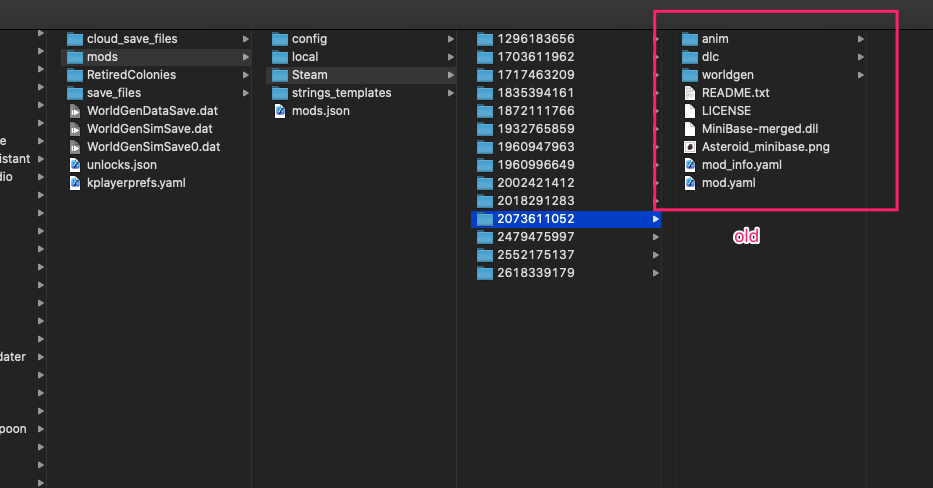
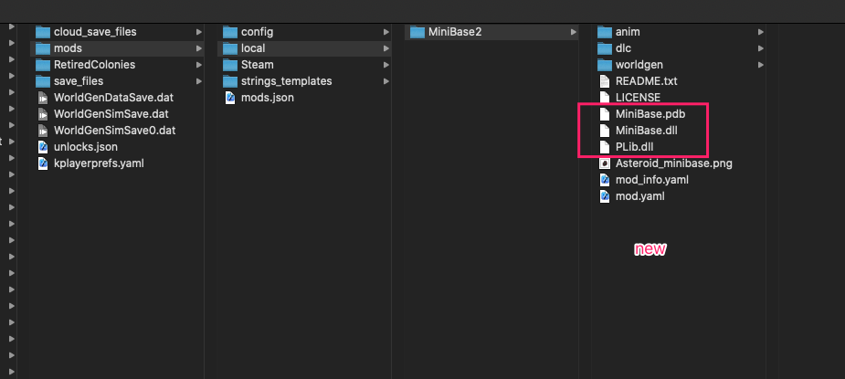
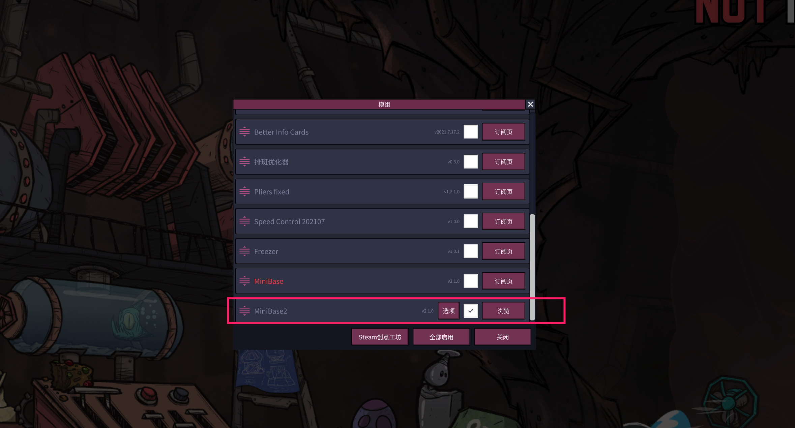

# Oxygen-Not-Included-Mods
Mods for Oxygen Not Included

## MiniBase fix steps

1. Go to the mod folder, for example: `/Users/[Your Name]/Library/Application Support/unity.Klei.Oxygen Not Included/mods` on MacOS. 
2. Create a folder called `local`, and create a local mod called `MiniBase2` or whatever you like. [Here's an explanation why](https://www.reddit.com/r/Oxygennotincluded/comments/hcqlxc/comment/fvlsg8u/?utm_source=share&utm_medium=web2x&context=3)
3. Copy old MiniBase mod's files to `MiniBase2`, delete `MiniBase-merged.dll` file, You can refer to the screenshots below.
4. Copy `MiniBase.dll`, `MiniBase.pdb`, `packages/PLib.4.6.0/lib/net471/PLib.dll` in this project to `MiniBase2`.
5. [optional] Modify `mod.yaml` to rename `MiniBase` to `MiniBase2`.
6. Enjoy yourself.

